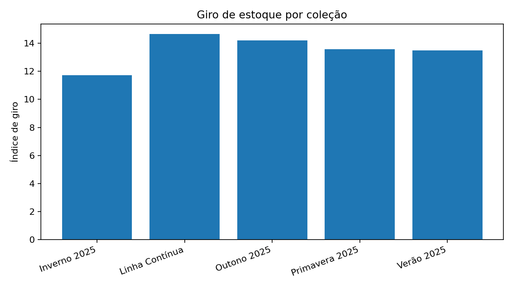
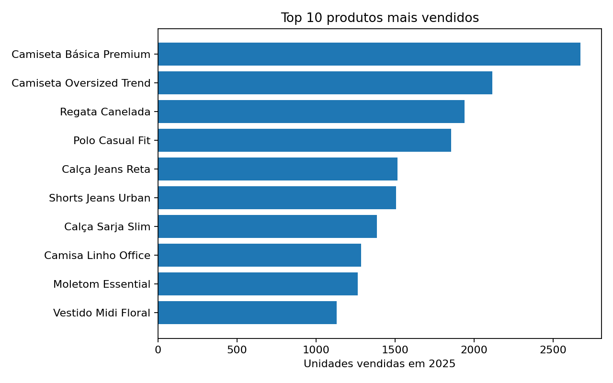
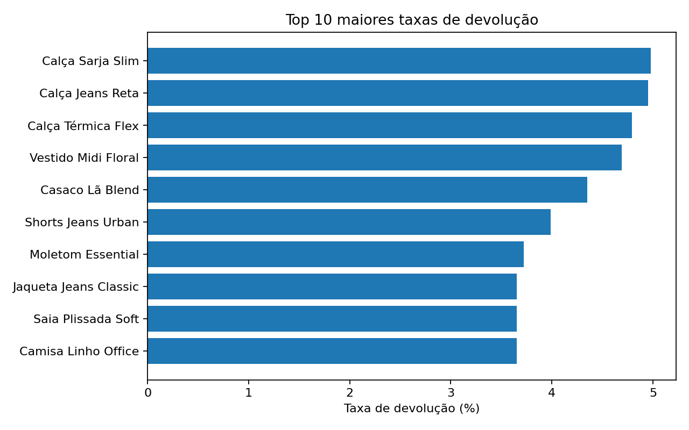
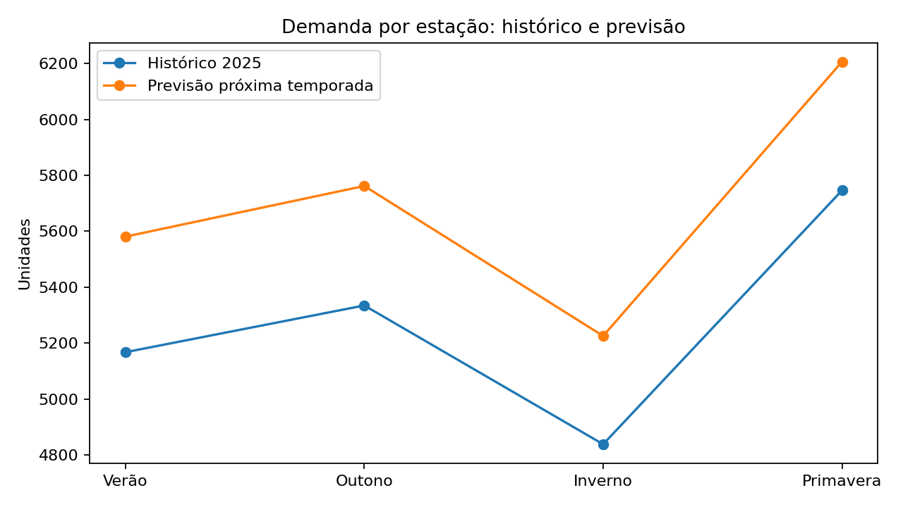

# Projeto de Análise de Dados — Indústria Têxtil

Projeto de portfólio para GitHub com **dados fictícios** de uma indústria têxtil de médio porte (**~200 funcionários**) chamada **Fio & Forma Confecções Ltda.**

O objetivo é analisar indicadores estratégicos que ajudam a área de operações, planejamento e comercial a tomar decisões melhores.

## Objetivos do projeto

Neste projeto, foram desenvolvidas e calculadas as seguintes métricas:

- **Giro de estoque por coleção**
- **Previsão de demanda por estação**
- **Produtos mais vendidos**
- **Devoluções por produto**
- **Margem por peça**

## Contexto do negócio

A empresa atua com coleções sazonais e linha contínua, produzindo peças como camisetas, calças, vestidos, moletons, casacos e camisas.

**Características da empresa fictícia:**
- Setor: Indústria têxtil
- Porte: Médio
- Funcionários: Aproximadamente 200
- Período analisado: Janeiro a Dezembro de 2025
- Quantidade de SKUs analisados: 15

## Estrutura do projeto

```bash
textil_data_project/
├── data/
│   ├── colecoes.csv
│   ├── devolucoes.csv
│   ├── estoque_mensal.csv
│   ├── produtos.csv
│   └── vendas_mensais.csv
├── reports/
│   ├── devolucoes_por_produto.csv
│   ├── giro_estoque_por_colecao.csv
│   ├── margem_por_peca.csv
│   ├── previsao_demanda_estacao.csv
│   ├── produtos_mais_vendidos.csv
│   ├── relatorio_executivo.md
│   └── figures/
│       ├── devolucoes_por_produto.png
│       ├── giro_estoque_por_colecao.png
│       ├── previsao_demanda_estacao.png
│       └── top_produtos.png
├── src/
│   ├── analysis.py
│   └── generate_data.py
├── .gitignore
├── LICENSE
├── requirements.txt
└── README.md
```

## Dicionário dos dados

### `produtos.csv`
Cadastro dos produtos analisados.

| Coluna | Descrição |
|---|---|
| sku | Código do produto |
| produto | Nome do produto |
| categoria | Categoria da peça |
| colecao | Coleção principal |
| custo_unitario | Custo unitário da peça |
| preco_venda | Preço unitário de venda |

### `vendas_mensais.csv`
Histórico de vendas por produto e mês.

| Coluna | Descrição |
|---|---|
| mes | Mês de referência |
| sku | Código do produto |
| quantidade_vendida | Quantidade vendida no mês |
| preco_unitario | Preço unitário de venda |
| receita_bruta | Receita total no mês |
| custo_total | Custo total do volume vendido |
| estacao | Estação do ano |
| colecao | Coleção associada |

### `estoque_mensal.csv`
Movimentação mensal de estoque.

| Coluna | Descrição |
|---|---|
| mes | Mês de referência |
| sku | Código do produto |
| estoque_inicial | Estoque inicial do mês |
| reposicao | Quantidade reposta no mês |
| quantidade_vendida | Quantidade vendida no mês |
| estoque_final | Estoque final do mês |
| colecao | Coleção associada |
| estacao | Estação do mês |

### `devolucoes.csv`
Registro de devoluções.

| Coluna | Descrição |
|---|---|
| mes | Mês de referência |
| sku | Código do produto |
| quantidade_devolvida | Quantidade devolvida |
| motivo | Motivo principal da devolução |

## Regras de negócio e fórmulas

### 1) Giro de estoque por coleção
**Fórmula usada:**

```text
giro de estoque = quantidade vendida / estoque médio
estoque médio = (estoque inicial + estoque final) / 2
```

### 2) Previsão de demanda por estação
Foi criada uma previsão simples baseada no histórico sazonal de vendas e em um crescimento planejado.

```text
previsão próxima temporada = demanda histórica da estação × 1,08
```

### 3) Produtos mais vendidos
Ranking dos produtos com base em quantidade vendida e receita bruta.

### 4) Devoluções por produto
```text
taxa de devolução (%) = quantidade devolvida / quantidade vendida × 100
```

### 5) Margem por peça
```text
margem unitária (R$) = preço de venda - custo unitário
margem (%) = margem unitária / preço de venda × 100
```

## Visualizações

### Giro de estoque por coleção


### Top 10 produtos mais vendidos


### Taxa de devolução por produto


### Previsão de demanda por estação


## Tecnologias utilizadas
- Python
- Pandas
- NumPy
- Matplotlib

## Como executar o projeto

```bash
git clone <SEU_LINK_DO_REPOSITORIO>
cd textil_data_project
python -m venv venv
source venv/bin/activate  # Mac/Linux
# ou venv\Scripts\activate no Windows
pip install -r requirements.txt
python src/analysis.py
```

## Ideias para evolução do projeto
- Criar dashboard em Power BI
- Construir app em Streamlit
- Fazer forecast com Prophet
- Adicionar análise por canal de venda
- Criar KPI de ruptura de estoque
- Medir sell-through por coleção
- Comparar margem por categoria
- Analisar impacto de devoluções no lucro
